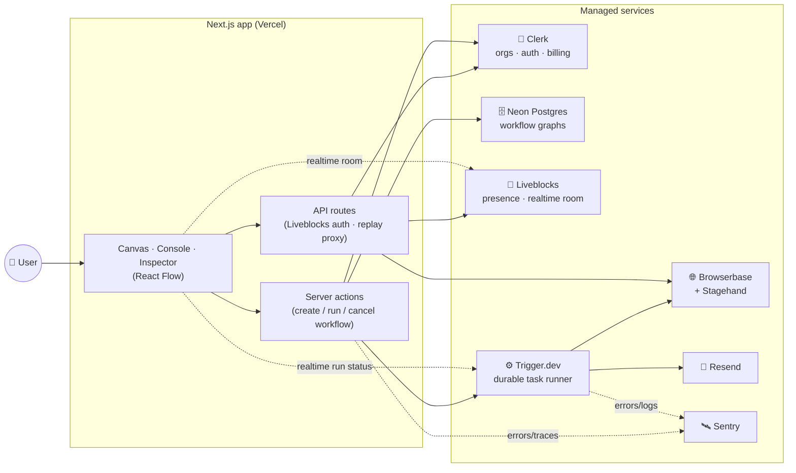

<!-- markdownlint-disable MD033 MD041 -->

<div align="center">


# Flowbrowse

**Build browser-automation workflows on a visual canvas — no code required.**

[](https://nextjs.org/)
[](https://www.typescriptlang.org/)
[](https://trigger.dev/)
[](https://clerk.com/)
[](https://neon.tech/)
[](https://github.com/RISHII7/Flowbrowse/releases/latest)

[Live demo](https://flowbrowse.vercel.app) · [Changelog](CHANGELOG.md) · [Architecture](docs/architecture.md)

</div>

---

## What is Flowbrowse?

Flowbrowse is a **drag-and-drop workflow builder for browser automation**. You wire
together nodes on a canvas — open a page, click something, extract data, run an
autonomous agent, send an email — and Flowbrowse turns that graph into a durable,
observable background job. Every run drives a real, recorded browser session, and
you can watch it happen live: which node is running, what it returned, and (if you're
on Pro) the full session replay.

It's built to be **collaborative and multi-tenant from day one**: every workflow lives
inside a Clerk organization, the canvas is a real-time multiplayer room (cursors,
presence, avatars), and a workflow's execution history is a first-class, browsable log
— not just a spinner that disappears when it's done.

## Feature tour

| | |
| :-- | :-- |
| 🧩 **Visual canvas** | A [React Flow](https://reactflow.dev/) graph of trigger + action nodes, wired together with edges. Built-in validation catches missing triggers, disconnected graphs, and cycles before you ever hit Run. |
| 🌐 **Browser automation nodes** | `Open URL`, `Act`, `Extract`, `Observe`, and an autonomous `Agent` node — all powered by [Stagehand](https://github.com/browserbase/stagehand) driving a real [Browserbase](https://www.browserbase.com/) session. |
| 📧 **Send Email node** | Fire a transactional email mid-workflow via [Resend](https://resend.com/), using upstream node output as its body. |
| 🔗 **Data passthrough** | Reference any upstream node's output in a downstream field with `{{nodeId.path}}` — with clickable "Connections" chips in the inspector so you never type a token by hand. |
| 📡 **Live run status** | The canvas lights up in real time as a run walks the graph — a spinner and blue border on the running node, red on failure — via [Trigger.dev Realtime](https://trigger.dev/). |
| 🖥️ **Run console** | A bottom panel listing every run and its steps (icon, duration, status), with an output inspector showing each step's result as formatted JSON or its error. |
| 🎬 **Session replay** *(Pro)* | Watch back the actual Browserbase recording of any finished run, streamed as HLS through an auth-gated proxy route. |
| 👥 **Real-time collaboration** | Multiple teammates edit the same canvas at once — [Liveblocks](https://liveblocks.io/) presence, cursors, and avatars, scoped privately to your Clerk organization. |
| 🏢 **Organizations & billing** | Every workflow is org-scoped. [Clerk Billing](https://clerk.com/docs/guides/billing/overview) gates premium capabilities (the Agent node, session replay) behind a Pro plan, enforced both client- and server-side. |
| 🛰️ **Full observability** | [Sentry](https://sentry.io/) error tracking, tracing, and session replay across the Next.js app *and* the Trigger.dev worker runtime, with structured `Sentry.logger` calls on every workflow action and API route. |

## Architecture at a glance



See [`docs/architecture.md`](docs/architecture.md) for the full breakdown, plus
dedicated diagrams for [workflow run execution](docs/workflow-execution.md),
[auth & billing gating](docs/auth-and-billing.md), and the
[data model](docs/data-model.md).

## Tech stack

- **Framework**: [Next.js 16](https://nextjs.org/) (App Router, Turbopack), React 19, TypeScript
- **Canvas**: [`@xyflow/react`](https://reactflow.dev/) (React Flow) + [`@liveblocks/react-flow`](https://liveblocks.io/) for multiplayer
- **Background jobs**: [Trigger.dev v4](https://trigger.dev/) — durable task runs, realtime status streaming, Sentry-instrumented
- **Browser automation**: [Stagehand](https://github.com/browserbase/stagehand) V3 on [Browserbase](https://www.browserbase.com/)
- **Auth & billing**: [Clerk](https://clerk.com/) — Organizations, ID-token auth for Liveblocks, org-scoped Billing/plans
- **Database**: [Neon](https://neon.tech/) serverless Postgres + [Drizzle ORM](https://orm.drizzle.team/)
- **Realtime collaboration**: [Liveblocks](https://liveblocks.io/)
- **Email**: [Resend](https://resend.com/)
- **Monitoring**: [Sentry](https://sentry.io/) — errors, tracing, session replay, structured logging
- **UI**: [shadcn/ui](https://ui.shadcn.com/), Radix primitives, Tailwind CSS v4
- **Styling of this repo**: Prettier (no semicolons, double quotes) + ESLint + markdownlint

## Project structure

```text
app/
  (auth)/                  Sign-in, sign-up, choose-organization
  (dashboard)/             Dashboard shell, workflows list, billing page
    workflows/[id]/        The workflow editor route
  api/
    liveblocks/            Liveblocks ID-token auth + user resolution
    replays/[sessionId]/   Auth-gated Browserbase replay proxy (HLS)

features/workflows/
  actions.ts               Server actions: create / run / cancel / delete
  data.ts                  DB reads/writes (Drizzle)
  tasks/run-workflow.ts     The Trigger.dev task — walks the graph, runs each node
  nodes/                   node-registry.ts (manifest) + one executor file per node
  components/              Canvas, right sidebar, console panel, session replay, ...
  hooks/                   useUpstreamConnections, useProPlan
  lib/                     validate-graph, interpolate ({{node.path}}), generate-slug

lib/                       Shared server clients (db, liveblocks, browserbase, resend)
specs/                     Design-doc prompts each feature was implemented from
docs/                      Architecture & flow documentation (this folder)
```

## Getting started

### Prerequisites

- Node.js 20+, npm
- Accounts (free tiers work): [Clerk](https://clerk.com/), [Neon](https://neon.tech/),
  [Trigger.dev](https://trigger.dev/), [Liveblocks](https://liveblocks.io/),
  [Browserbase](https://www.browserbase.com/), [Resend](https://resend.com/),
  [Sentry](https://sentry.io/)

### Setup

```bash
git clone https://github.com/RISHII7/Flowbrowse.git
cd Flowbrowse
npm install
```

Copy the environment template and fill in each key from its dashboard:

```bash
cp .env.example .env.local
```

Push the Drizzle schema to your Neon database:

```bash
npm run db:push
```

Run the app and the Trigger.dev dev worker side by side:

```bash
npm run dev              # Next.js — http://localhost:3000
npx trigger.dev@latest dev   # Trigger.dev worker (required for Run to do anything)
```

### Everyday commands

| Command | What it does |
| :-- | :-- |
| `npm run dev` | Start the Next.js dev server (Turbopack) |
| `npm run build` / `npm run start` | Production build and start |
| `npm run lint` | ESLint |
| `npm run format` | Prettier, writes in place |
| `npm run typecheck` | `tsc --noEmit` |
| `npm run db:generate` / `db:migrate` / `db:push` / `db:studio` | Drizzle Kit |
| `npx trigger.dev@latest dev` | Run the Trigger.dev worker locally |

## Documentation

- [`docs/architecture.md`](docs/architecture.md) — full system architecture
- [`docs/workflow-execution.md`](docs/workflow-execution.md) — how a run actually executes, node by node
- [`docs/auth-and-billing.md`](docs/auth-and-billing.md) — org auth, and how the Pro-plan gates work
- [`docs/data-model.md`](docs/data-model.md) — the database schema and where each entity actually lives
- [`CHANGELOG.md`](CHANGELOG.md) — every release, in detail
- [`AGENTS.md`](AGENTS.md) — conventions for AI coding agents working in this repo
- [`specs/`](specs) — the original design-doc prompts each feature was built from

## License

Private project — all rights reserved.
