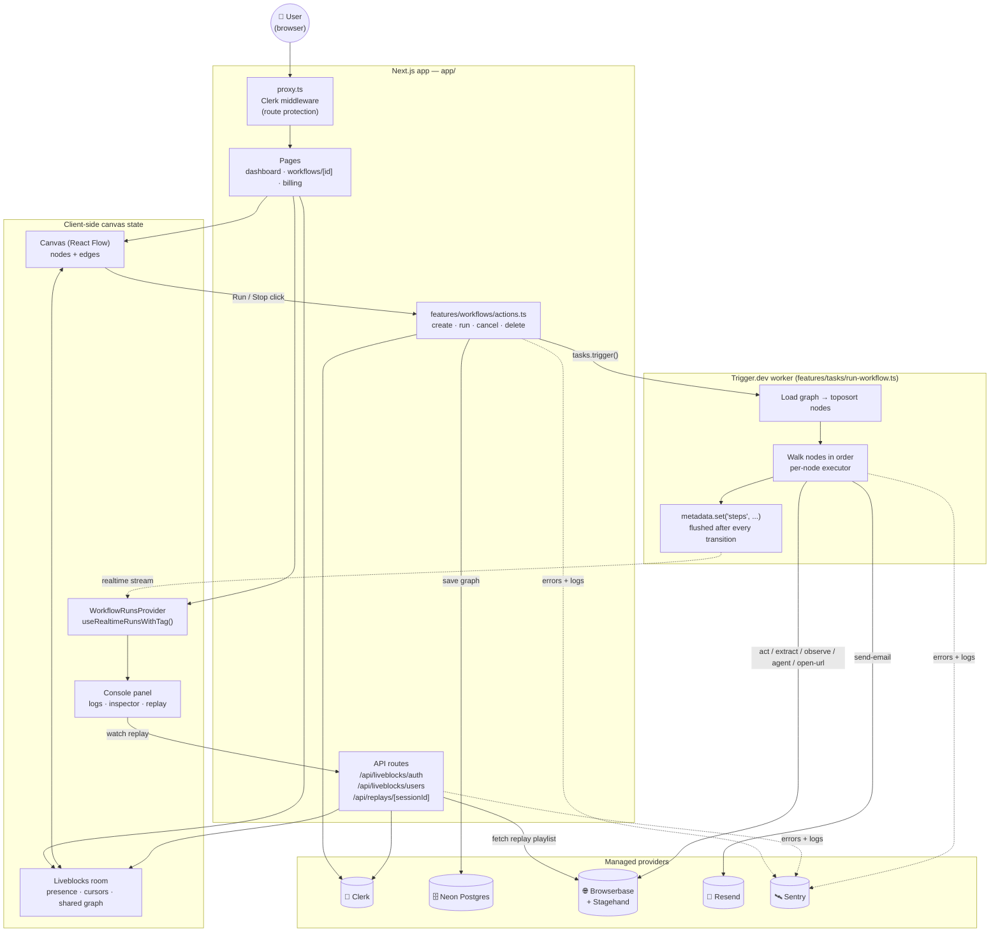

# Architecture

Flowbrowse is a Next.js app that orchestrates six managed services. Nothing in the
app talks directly to a database driver or a browser — every non-trivial capability
(auth, persistence, background execution, browser automation, realtime, email,
observability) is delegated to a purpose-built provider. The app's job is to wire
those providers together behind one coherent canvas.

This document covers the system end to end. For narrower, sequence-level detail see:

- [`workflow-execution.md`](workflow-execution.md) — what happens, step by step, when a run fires
- [`auth-and-billing.md`](auth-and-billing.md) — org auth and how the Pro-plan gates work
- [`data-model.md`](data-model.md) — what's actually persisted in Postgres, and what isn't

## The pieces

| Service | Role | Where it's used |
| :-- | :-- | :-- |
| **Clerk** | Auth, Organizations, Billing | `middleware` (route protection), every server action/route (`auth()`), `app/(dashboard)/billing` |
| **Neon Postgres** (via Drizzle) | Persists workflow graphs | `lib/db/schema.ts`, `features/workflows/data.ts` |
| **Trigger.dev** | Durable background execution + realtime status | `features/workflows/tasks/run-workflow.ts`, `workflow-runs-provider.tsx` |
| **Browserbase + Stagehand** | The actual browser a workflow drives | `features/workflows/nodes/*.ts` executors |
| **Liveblocks** | Multiplayer canvas (presence, cursors, avatars) | `features/workflows/components/room.tsx`, `app/api/liveblocks/*` |
| **Resend** | Transactional email node | `features/workflows/nodes/send-email.ts` |
| **Sentry** | Errors, tracing, session replay, structured logs | `instrumentation*.ts`, `sentry.*.config.ts`, `features/init.ts` |

## System diagram

## Layer by layer

### 1. Route protection

`proxy.ts` wraps every request in `clerkMiddleware`. Everything except `/sign-in`
and `/sign-up` requires an authenticated session (`auth.protect()`); the Sentry
tunnel route (`/monitoring`) is explicitly excluded from the matcher so it isn't
gated behind auth. If a signed-in user has no active organization, Clerk's
`taskUrls` config (`app/layout.tsx`) routes them through `/choose-organization`
before they can reach the dashboard.

### 2. The canvas

The workflow editor (`app/(dashboard)/workflows/[id]/page.tsx`) wraps the page in
three providers, each independent of the others:

- **`Room`** — a Liveblocks `RoomProvider`, so the graph itself is shared,
  multiplayer state (see [`auth-and-billing.md`](auth-and-billing.md) for how
  access is scoped to the org).
- **`ReactFlowProvider`** — one shared React Flow store so the canvas and the
  right-sidebar toolbar/inspector can both read/write node state.
- **`WorkflowRunsProvider`** — a `useRealtimeRunsWithTag` subscription to every
  Trigger.dev run tagged `workflow:<id>`, using a public access token minted
  server-side and scoped to just that tag (`auth.createPublicToken`).

The canvas itself (`node-registry.ts`) is a single source of truth: each node type
declares its label, icon, accent color, editable fields, and outputs. The toolbar,
the inspector, the step node's rendering, and the run task's executor lookup all
read from this one registry — adding a node type never touches those consumers.

### 3. Server actions — the only write path

`features/workflows/actions.ts` is the sole way anything reaches Postgres or
Trigger.dev. There is no separate REST API for workflow CRUD; the client calls
these `"use server"` functions directly. Every action:

1. Confirms an active Clerk org (`auth()` → `orgId`).
2. Tags a Sentry isolation-scope with the action name and relevant ids.
3. Does its one job (`createWorkflow`, `saveWorkflowGraph`, `tasks.trigger(...)`, `runs.cancel(...)`).
4. Logs the outcome via `Sentry.logger`.

`runWorkflowAction` additionally re-validates the graph server-side (never trust
the client's last validation) and enforces the Agent-node Pro gate before
triggering — see [`auth-and-billing.md`](auth-and-billing.md).

### 4. The Trigger.dev worker

`run-workflow.ts` is a completely separate execution environment from the Next.js
app — no request, no Clerk session, no React. It:

1. Loads the saved graph and topologically sorts connected nodes.
2. Seeds every node as a `"pending"` step and publishes that to run metadata.
3. Opens one lazy, shared Browserbase/Stagehand session (reused across every
   browser node in the run, so a recording spans the whole workflow).
4. Walks nodes in order, resolving `{{nodeId.path}}` placeholders against
   already-produced output, running each node's executor, and publishing
   `running` → `done`/`failed` transitions (with duration, output, and error)
   after every step.

See [`workflow-execution.md`](workflow-execution.md) for the full step-by-step.

### 5. Realtime, twice over

Two independent realtime channels feed the UI, and they're not the same thing:

- **Liveblocks** carries the *editing* state — who's on the canvas, their cursor,
  and the live graph as it's being edited.
- **Trigger.dev Realtime** carries the *execution* state — which run is live,
  which step it's on, what each step produced. `WorkflowRunsProvider` derives
  `useLatestRunSteps()` (for painting the canvas) and `useConsoleRuns()` /
  `useLiveRun()` (for the console and the Run/Stop button) from the same
  underlying subscription.

### 6. Observability

Sentry is initialized twice, independently, because the two runtimes never share
a process: `instrumentation.ts` + `instrumentation-client.ts` cover the Next.js
app (server, edge, and browser), while `features/init.ts` is auto-loaded by
Trigger.dev before any task runs and registers a global `tasks.onFailure` hook.
Both report to the same Sentry project; `next.config.ts` and `trigger.config.ts`
each wire up source-map upload for their respective build.

## Where each provider's credential lives

Every external key is documented in [`.env.example`](../.env.example) with a
comment on which server-side module reads it. Nothing external is called from
client code with a secret key in hand — the client only ever holds
short-lived, narrowly-scoped tokens (a Liveblocks ID token, a Trigger.dev public
access token scoped to one workflow's tag).
