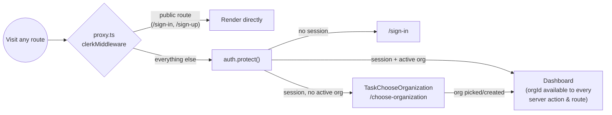
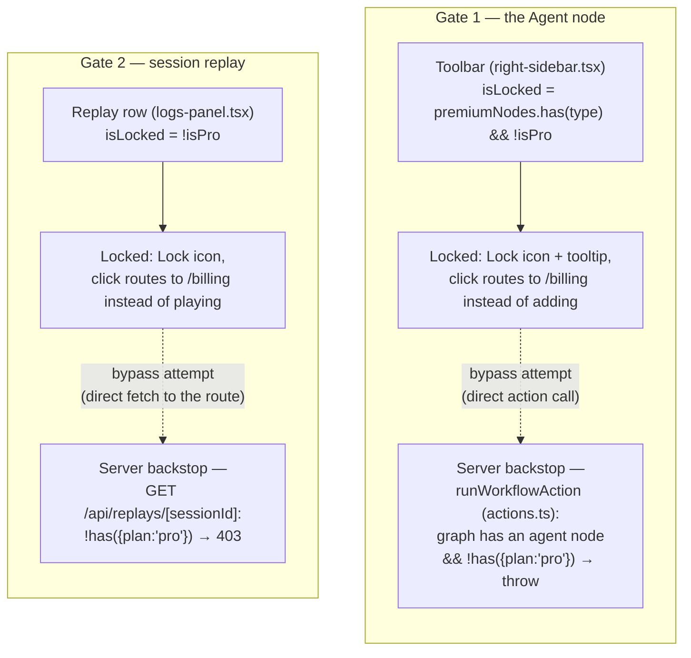

# Auth & billing

Flowbrowse is organization-first: every workflow, run, and Liveblocks room is
scoped to a Clerk **organization**, never to an individual user account. Billing
follows the same shape — it's the *organization* that subscribes to Pro, not a
person.

## Sign-in → active org



Clerk's session task system (`ClerkProvider`'s `taskUrls` in `app/layout.tsx`)
is what forces the choose-organization step — a signed-in user with no active org
is redirected there automatically before ever reaching a protected page. From
that point on, every server action and API route gets `orgId` for free from
`auth()`.

## The Pro plan

Configured entirely in Clerk (no local representation) via the CLI/PLAPI:

- Billing enabled for **organizations only** (`organization_enabled: true`,
  `user_enabled: false`) — there is no per-user billing in this app.
- A `pro` plan, `payer_type: "org"`, alongside the `free_org` plan Clerk creates
  automatically once billing is turned on.
- The upgrade surface is `app/(dashboard)/billing/page.tsx`, rendering Clerk's
  `<PricingTable for="organization" />` — checkout happens entirely inside
  Clerk's own drawer.

### `useProPlan()` — the one hook every gate uses

```ts
// features/workflows/hooks/use-pro-plan.ts
const { has, isLoaded } = useAuth()
const isPro = has?.({ plan: "pro" }) ?? false
```

`isLoaded` matters: until Clerk hydrates the session, `has` is `undefined`, and
every gate treats that as "still loading" rather than "not subscribed" — so a
Pro org never flashes a locked state on first paint.

## What's actually gated

Two capabilities are Pro-only today, and both are enforced **twice** — once for
UX (instant, client-side feedback) and once for real (server-side, so the gate
can't be bypassed by calling the underlying route/action directly):



### Gate 1 — the Agent node

The Agent node is the most expensive to run (an autonomous multi-step browser
agent), so it's the one node type gated behind Pro. Every other node type stays
free — building workflows at all is never blocked.

- **Client**: `right-sidebar.tsx`'s toolbar computes `isLocked(type)` per node
  type against a `premiumNodes` set (currently just `["agent"]`). A locked node
  renders with a `Lock` icon and a tooltip; clicking it calls `goToUpgrade()`
  instead of adding the node to the canvas.
- **Server**: `runWorkflowAction` inspects the *graph being run*
  (`graph.nodes.some(n => n.data.type === "agent")`) and throws
  `"The Agent node requires the Pro plan."` if the org isn't Pro. This matters
  because the Trigger.dev task itself has **no Clerk session at all** — the gate
  has to live in the action that still has `has()` available, before the run is
  ever triggered.

### Gate 2 — session replay

- **Client**: the console's `ReplayRow` (`logs-panel.tsx`) locks the same way,
  redirecting to `/billing` on click instead of opening the recording.
- **Server**: `GET /api/replays/[sessionId]` checks `has({ plan: "pro" })` right
  after confirming the caller has an active org, and returns `403` before ever
  calling Browserbase — so a non-pro org can't pull a recording by hitting the
  route directly with a known session id, even though the UI would never show
  them that id in the first place.

## Why two enforcement points, not one

The client-side lock is pure UX — instant feedback, no network round-trip, and
it's what stops a Pro-eligible-looking flow from feeling broken. It is **not**
a security boundary on its own, because both the create-node click and the
replay-row click are just JavaScript a user's browser already has loaded; anyone
could call `runWorkflowAction` or fetch the replay route directly with the
right ids. The server-side check in the action / route is the actual boundary,
and it's what every Sentry `logger.warn` call on a denial (`"Workflow run denied
— Agent node requires Pro plan"`, `"Session replay denied — Pro plan required"`)
is watching for — if these start showing up, someone's UI is out of sync with
their plan, or someone's probing the gate directly.
