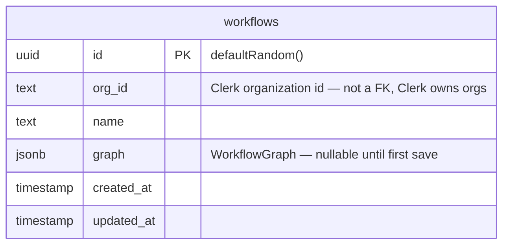
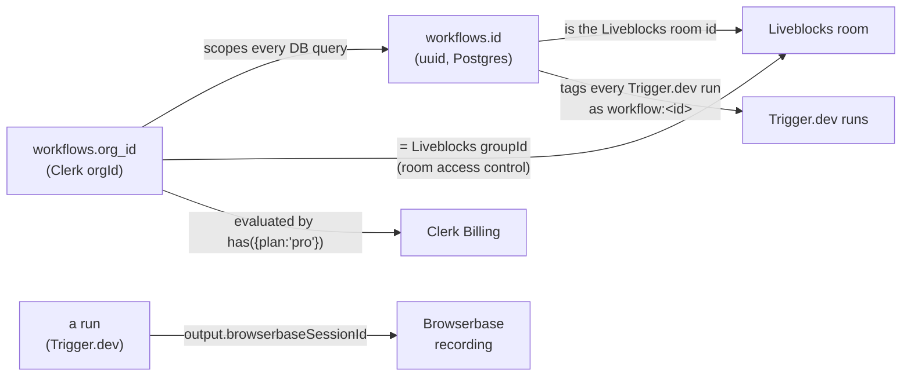

# Data model

Flowbrowse's own Postgres schema is deliberately small: **one table**. Runs,
presence, sessions, and org membership are not duplicated into Postgres — each
lives in the system that already owns it, keyed off the same ids. This document
covers what's actually in the database, and then maps out where everything else
that *feels* like data actually lives.

## The one table



`lib/db/schema.ts` in full:

```ts
export const workflows = pgTable("workflows", {
  id: uuid("id").primaryKey().defaultRandom(),
  orgId: text("org_id").notNull(),
  name: text("name").notNull(),
  graph: jsonb("graph").$type<WorkflowGraph>(),
  createdAt: timestamp("created_at").defaultNow().notNull(),
  updatedAt: timestamp("updated_at").defaultNow().notNull(),
})
```

Every query in `features/workflows/data.ts` filters on **both** `id` and
`orgId` (`and(eq(workflows.id, id), eq(workflows.orgId, orgId))`) — org
scoping isn't a separate authorization layer bolted on top, it's baked into
every read and write at the query level. There's no row-level security policy
to keep in sync with application logic, because there's only one code path
into this table and it always filters this way.

### The `graph` column

`graph` is a single `jsonb` blob shaped exactly like React Flow's own state,
on purpose — no remapping between "React Flow's shape" and "the shape we
persist":

```ts
type WorkflowGraph = {
  nodes: StepNodeType[]  // Node<StepNodeData, "step">
  edges: Edge[]          // @xyflow/react's own Edge type
}

type StepNodeData = {
  type: NodeType              // key into node-registry.ts, e.g. "open-url"
  kind: "trigger" | "action"
  title: string               // shown on the canvas + denormalized into RunStep
  values: Record<string, string>  // this node's field inputs, by field key
}
```

It's nullable because a freshly created workflow (`createWorkflowAction`) has no
graph yet — `saveWorkflowGraph` (called on every edit and again just before a
run) is what first populates it, after running it through `validateGraph()`.

## Everything else, and where it actually lives

| "Entity" | Lives in | Keyed by | Why not Postgres |
| :-- | :-- | :-- | :-- |
| **Organizations & members** | Clerk | `orgId` (`org_xxx`) | Clerk is the source of truth for org membership, roles, and billing — mirroring it would just be a cache to keep in sync |
| **Runs & their steps** | Trigger.dev (run metadata + output) | tag `workflow:<workflowId>` | Runs are inherently ephemeral, high-volume, and already have a purpose-built realtime + retention system — see [`workflow-execution.md`](workflow-execution.md) |
| **Canvas presence / cursors** | Liveblocks (in-memory room state) | room id === `workflows.id` | Presence isn't meant to be durable; Liveblocks' storage is the live document, Postgres holds the last **saved** snapshot |
| **Browser session recording** | Browserbase | `browserbaseSessionId` (from a run's `output`, not persisted anywhere else) | The recording is fetched on demand through the replay proxy — nothing about it is stored in this app at all |
| **Billing plan / subscription** | Clerk Billing | `orgId` | `has({ plan: "pro" })` is evaluated live against Clerk on every check — no local `subscriptions` table to drift out of sync |

## How the ids thread together



A workflow's `id` is reused, unmodified, as its Liveblocks room id
(`getOrCreateRoom(id, ...)`) and as the Trigger.dev tag every one of its runs
carries (`workflow:${id}`). There is no separate join table or mapping to
maintain — the same UUID *is* the join key across all three systems.

## Migrations

Schema changes go through Drizzle Kit, not hand-written SQL:

```bash
npm run db:generate   # writes a new migration from schema.ts
npm run db:migrate    # applies pending migrations
npm run db:push       # dev-only: push schema.ts straight to the DB, no migration file
npm run db:studio     # Drizzle Studio — browse/edit data in a local UI
```
