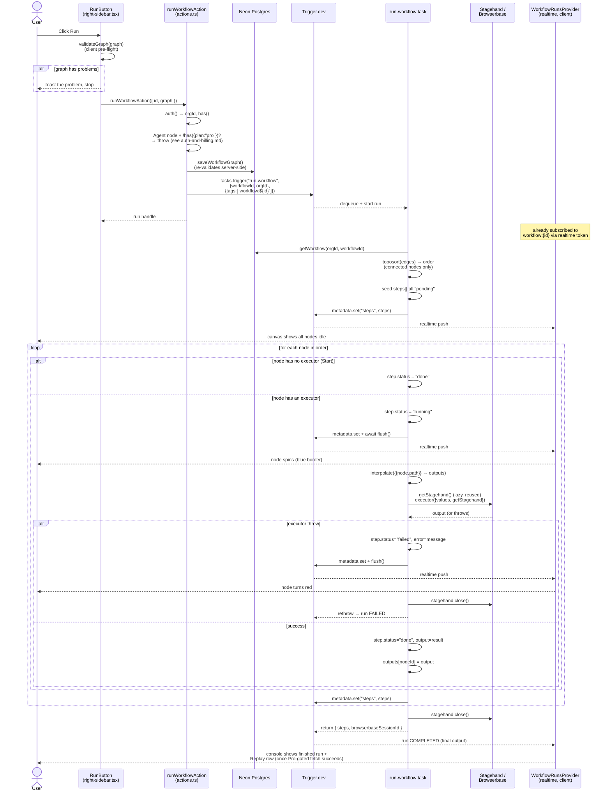

# Workflow run execution

What actually happens, in order, from clicking **Run** to a finished, replayable
run. This is the most load-bearing path in the app — the canvas, the console, and
session replay are all just different views onto the state this document describes.

## Sequence diagram

## Step by step

### 1. Client-side pre-flight (`validateGraph`)

Before anything reaches the server, `RunButton` runs the same `validateGraph()`
that the server also runs — a pure function with three checks:

- Exactly one `Start` trigger node.
- At least one edge (an unconnected graph is a no-op run).
- No cycle (`toposort` throws on one; caught and turned into a friendly message).

This is a UX shortcut, not a security boundary — see step 2.

### 2. `runWorkflowAction` (the only entry point)

The server action re-runs validation itself before saving, because the client's
check can't be trusted (stale state, a bypassed UI, a direct call). It then:

1. Confirms an active org and — if the graph contains an `agent` node — that the
   org is on the Pro plan (thrown as a plain `Error`, shown to the user as a toast).
2. Persists the graph (`saveWorkflowGraph`, itself re-validating as a backstop).
3. Triggers the task: `tasks.trigger<typeof runWorkflowTask>("run-workflow", { workflowId, orgId }, { tags: [\`workflow:${id}\`] })`.

The tag is the thread that ties everything together — the client's
`WorkflowRunsProvider` is already subscribed to every run carrying that exact tag,
via a public access token scoped to it and minted when the page loaded.

### 3. Inside the task: ordering

`run-workflow.ts` loads the workflow's saved `graph` (nodes + edges — see
[`data-model.md`](data-model.md)), builds a `Map` from node id to node, and asks
`toposort` for a dependency order. Only nodes touching at least one edge run —
an orphaned node dropped on the canvas is silently skipped, matching what the
canvas visually implies (it's not wired into anything).

### 4. Steps: the one piece of state that matters

Before any node runs, every node in the order gets a `RunStep` entry seeded as
`"pending"`, denormalizing its `type` and `title` from the graph so downstream
consumers (the canvas, the console) never have to re-read it. This whole array is
published to the run's Trigger.dev **metadata** under the key `"steps"` — that's
the single channel every live view reads from.

### 5. The node loop

For each node in order:

- **No executor** (the `start` trigger has none) → marked `"done"` immediately.
  Earlier versions left it `"pending"` forever, which read as "skipped" in the
  console — this was one of the fixes recorded in `specs/console-panel.md`.
- **Has an executor** → marked `"running"`, published, and — critically —
  **flushed** (`await metadata.flush()`). Without the forced flush, the SDK's
  normal batched flush could coalesce `"running"` straight into `"done"` and the
  canvas would never show a spinner.
- Field values are interpolated: any `{{nodeId.path}}` placeholder in the node's
  configured fields is swapped for the real value from an already-executed
  upstream node (see the `outputs` map, populated in dependency order so a
  referenced id is always already resolved).
- The executor runs, timed from just before the call. On success, its return
  value becomes both `outputs[nodeId]` (for future interpolation) and
  `step.output` (for the console's inspector, rendered as formatted JSON).
- On **failure**, the step is marked `"failed"` with its duration and the
  thrown error's message, metadata is flushed *before* the throw unwinds — a
  thrown run has no `return` value, so this flush is the only way the failure
  and its message ever reach the client — the shared Stagehand session is
  closed, and the error is rethrown to fail the run.

### 6. The node executors

Every action node's executor has the same shape: `(ctx: { values, getStagehand }) => Promise<unknown>`,
registered in `node-executors.ts` against a `satisfies Record<ActionNodeType, NodeExecutor>`
contract — so a node type missing an executor is a **compile-time** error, not a
runtime surprise.

| Node | File | Does | Returns |
| :-- | :-- | :-- | :-- |
| `open-url` | `open-url.ts` | Navigates the shared page to a URL | `{ url, title }` |
| `act` | `act.ts` | Runs a Stagehand `act()` instruction (click, type, ...) | `{ success, message, url }` |
| `extract` | `extract.ts` | Runs a Stagehand `extract()` instruction | `{ extraction }` |
| `observe` | `observe.ts` | Runs a Stagehand `observe()` instruction | `{ matches: [{ selector, description }] }` |
| `agent` | `agent.ts` | Runs Stagehand's autonomous multi-step agent (**Pro-gated**) | `{ success, message, completed }` |
| `send-email` | `send-email.ts` | Sends via Resend, throws on API error (SDK doesn't) | `{ id }` |

All five browser nodes share **one lazily-created Stagehand/Browserbase session**
per run (`getStagehand()`), opened on the first browser node and reused by every
later one — so a single recording covers the entire workflow, not one clip per
node. The session id is captured the moment it opens and returned in the run's
final `output`, which is how session replay finds it later.

### 7. Completion

On success, the task returns `{ steps, browserbaseSessionId }` as the run's
`output`. This is important: **the live "steps" view (metadata) and the final
view (output) are different fields**, and `workflow-runs-provider.tsx` explicitly
prefers `output.steps` once a run is finished, falling back to `metadata.steps`
only while it's still in flight or if it failed. The same asymmetry is why
`browserbaseSessionId` — needed for replay — is only ever read from `output`: the
recording itself lags the session closing by a few seconds, so there'd be nothing
to play even if it were exposed earlier.

### 8. What the client renders from all of this

- **Canvas** (`step-node.tsx`) — `useLatestRunSteps()` → spinner + blue border on
  the running node of the *most recent* run, red border on failure, only while
  that run `isLive`.
- **Console** (`logs-panel.tsx` / `inspector-panel.tsx`) — `useConsoleRuns()` →
  every run, newest first, each with all of its steps; clicking a step opens its
  output/error in the inspector.
- **Run/Stop button** (`right-sidebar.tsx`) — `useLiveRun()` → if any run is
  live, the button becomes a destructive **Stop** that calls
  `cancelWorkflowRunAction(liveRun.id)` instead of starting a new one.
